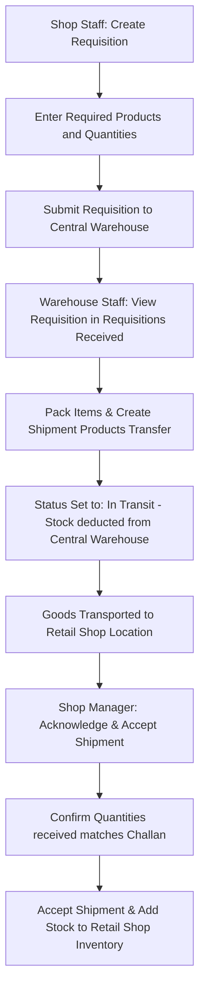
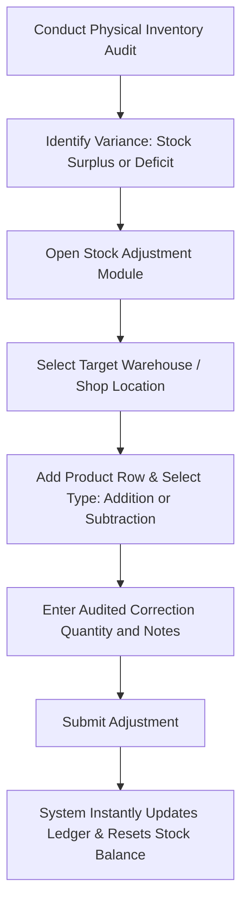
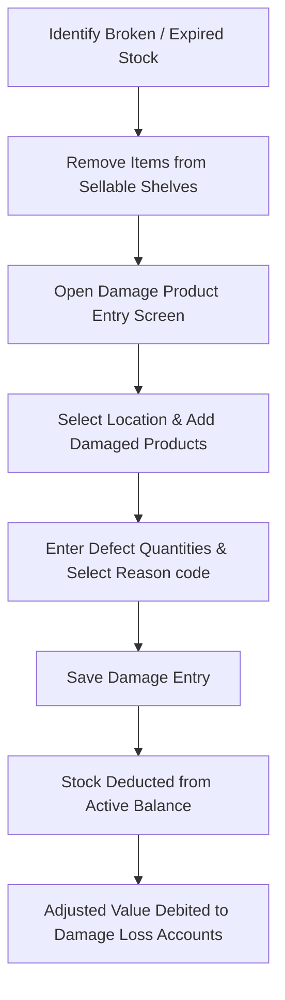

# Inventory Workflow Processes

This section explains internal logistics including shop requisitions, transfer confirmations, inventory auditing adjustments, and damage write-offs.

---

## 1. Shop Requisition & Warehouse Transfer Process

When a retail shop runs low on stock, it requisitions replenishment inventory from the central warehouse:

---

## 2. Inventory Adjustment & Audit Correction

To resolve differences between physical stock levels (audited) and system records:

---

## 3. Damage & Expiration Write-off Process

Removing items that are unsellable due to physical breakage, expiration, or defects:

---

## 4. Summary of Stock Statuses

During transfer operations, product stock shifts between distinct states:

| Stock State | Description | Location Assignment |
| :--- | :--- | :--- |
| **Available** | Active, sellable stock on hand. | Assigned to a specific Warehouse or Shop. |
| **In Transit** | Dispatched but not yet accepted by the destination. | Temporarily cleared from the source; not yet added to destination. |
| **Damaged / Expired** | Written off inventory due to loss. | Cleared from active inventory list; logged to reports. |
| **Used Product** | Allocated internally for business use. | Removed from commercial stock; logged to expense categories. |

---

## Business Rules

* **Transfer Verification**: Warehouse-to-warehouse transfers must be accepted by the destination branch before the transfer status switches to "Completed".
* **Minimum Safety Stock**: Products that drop below their safety stock limit trigger alerts on the Dashboard and Stock Reports to notify purchasing agents.
