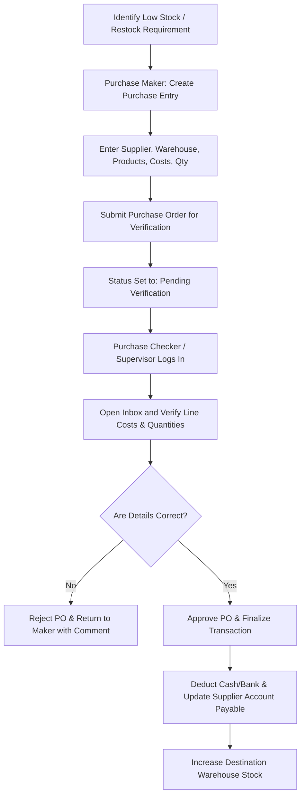
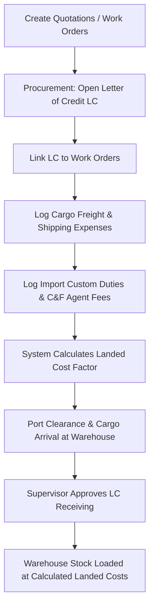
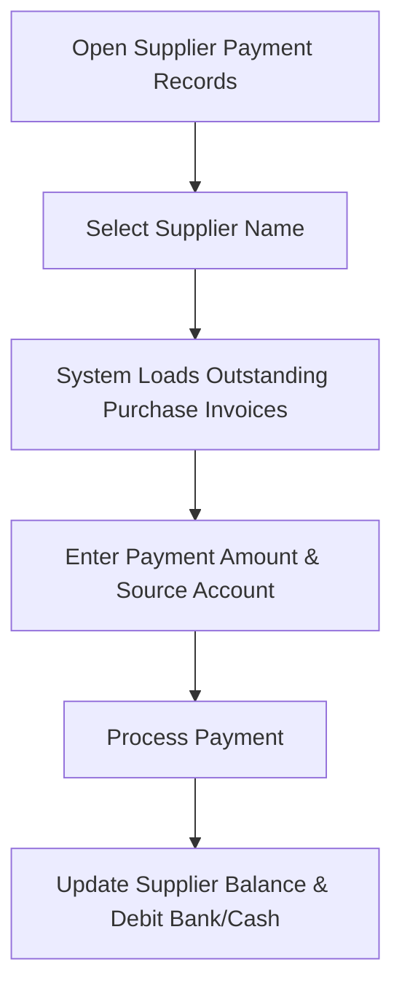

# Procurement Workflow

This section outlines the business flows for procurement, starting from local purchase entry to imports (LC module), and purchase returns.

---

## 1. Local Purchase Order Lifecycle (Maker-Checker)

Local purchases are subject to dual-verification checks to ensure data accuracy and financial auditability:

---

## 2. Import Costing & LC Workflow

For overseas imports, procurement follows a structured cargo tracking and landed cost calculation process:

---

## 3. Supplier Settlement Process

Clearing payables for past credit purchases:

---

## 4. Supplier Return Process (Purchase Return)

Returning defective or incorrect inventory items to suppliers:

| Step | Action | Details / Rules |
| :--- | :--- | :--- |
| **1. Initiate Return** | Go to **Purchase Return List** or **Direct Purchase Return** (if original invoice is unavailable). | Select supplier. |
| **2. Select Items** | Select the products and input return quantities. | Cannot exceed original invoice quantities. |
| **3. Adjust Balances** | Deduct return totals from the Supplier Due balance. | If invoice is already paid, request a cash refund or ledger credit. |
| **4. Update Stock** | Save return. | System reduces the warehouse stock balance immediately. |

---

## Business Rules for Procurement

* **Landed Cost Allocation**: Supplementary import costs (customs, freight, agent commissions) are apportioned across the imported product line based on value or weight, yielding a realistic item-level landed cost.
* **Payment Validation**: Upfront payments recorded in the Purchase Entry Form cannot exceed the total invoice value.
