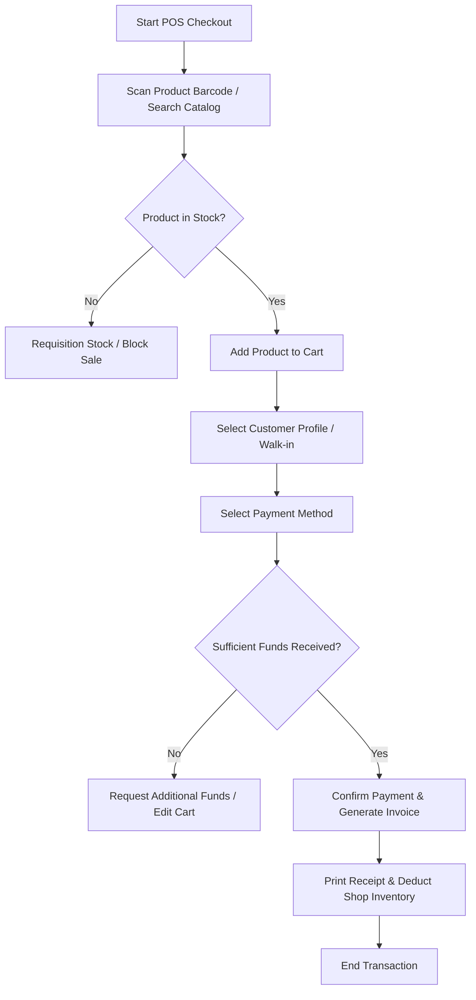
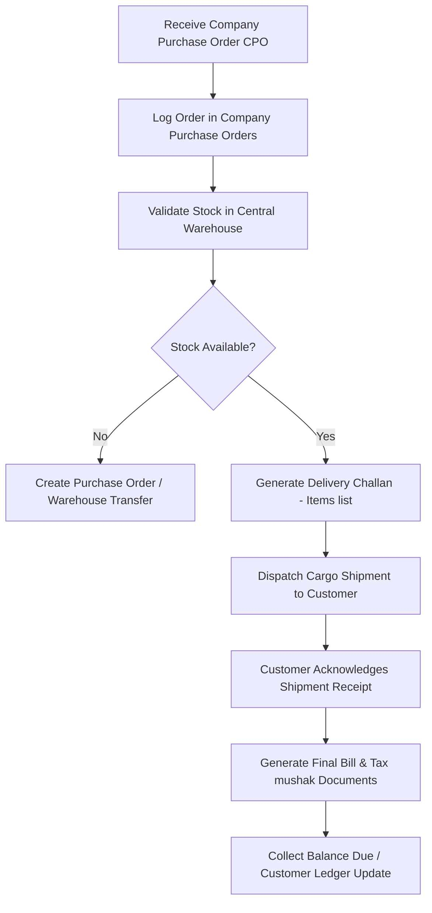
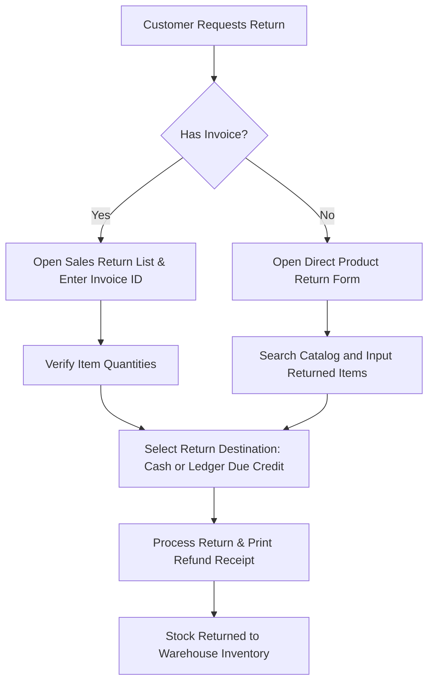

# Sales Process Workflow

This section outlines the business paths for standard retail purchases, credit sales, corporate order dispatches, and return handling.

---

## 1. Retail POS Checkout Process

For counter-based sales, transactions are instant and follow a direct path:

---

## 2. Wholesale Delivery Process (CPO Workflow)

When corporate clients issue Company Purchase Orders (CPOs), items are processed, packaged, and shipped through warehouses:

---

## 3. Billing Document Types

During the sales process, different billing documents are issued based on transaction phases:

| Document Type | Purpose | Financial Impact |
| :--- | :--- | :--- |
| **Sales Invoice (POS Receipt)** | Handed to walk-in retail customers. | Increases income account; decreases inventory. |
| **Delivery Challan** | Shipping slip for transport logistics. | Moves stock from "In Warehouse" to "In Transit" status. |
| **Mushak (VAT Invoice)** | Official tax statement for compliance. | Records VAT payable on government registers. |
| **Final Bill** | Invoice detailing payment terms and totals. | Adjusts customer ledger accounts receivable. |

---

## 4. Product Return Lifecycle

When a customer brings back purchased merchandise:

---

## Business Rules & Compliance

* **Invoice Modifications**: Once a POS checkout transaction is printed, it is closed. It cannot be edited. Errors must be corrected by creating a **Sales Return** or writing off stock.
* **Delivery-Billing Match**: The final bill totals must exactly match the quantities shipped on the delivery challan. Any shipping damages must be adjusted prior to final billing.
